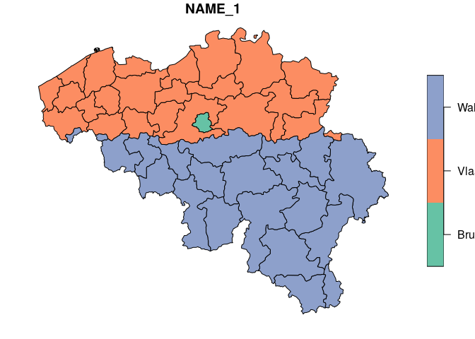

# iseDataRetrieval

[](https://github.com/inSileco/iseDataRetrieval/actions/workflows/R-CMD-check.yaml)
[](https://www.tidyverse.org/lifecycle/#experimental)

> Miscellaneous functions and scripts for data retrieval.

⚠️ We recommend using https://github.com/rspatial/geodata for GADM data.

⚠️ Early versions of the package used to allow for the downloading of the package, 
we now recommend using the package [fontawesome](https://rstudio.github.io/fontawesome/index.html).

⚠️ get_climate_nam_grids() is no longer available because data have been removed form the ftp server (there are available here now https://www.wdc-climate.de/ui/project?acronym=CanClim)


# Installation

``` r
if (!require("remotes")) install.packages("remotes")
remotes::install_github("inSileco/iseDataRetrieval")
```

Once installed, load the package

``` r
library(iseDataRetrieval)
```


## Retrieve boundaries

⚠️ See https://github.com/rspatial/geodata 

``` r
plot(get_gadm("BEL", level = 1, path = "output")[4])
```

    ## ⚠ Looks like this file has already been downloaded.

<!-- -->

``` r
plot(get_gadm("BEL", level = 3, format = "gpkg", path = "output")[4])
```

    ## ℹ `gpkg` selected, all administrative levels will be downloaded.
    ## ⚠ Looks like this file has already been downloaded.

    ## ℹ unzip archive output

    ## Reading layer `gadm36_BEL_3' from data source `/home/kevcaz/Projects/inSileco/iseDataRetrieval/output/gadm36_BEL.gpkg' using driver `GPKG'
    ## Simple feature collection with 43 features and 16 fields
    ## Geometry type: MULTIPOLYGON
    ## Dimension:     XY
    ## Bounding box:  xmin: 2.555356 ymin: 49.49722 xmax: 6.40787 ymax: 51.50382
    ## Geodetic CRS:  WGS 84

<!-- -->
